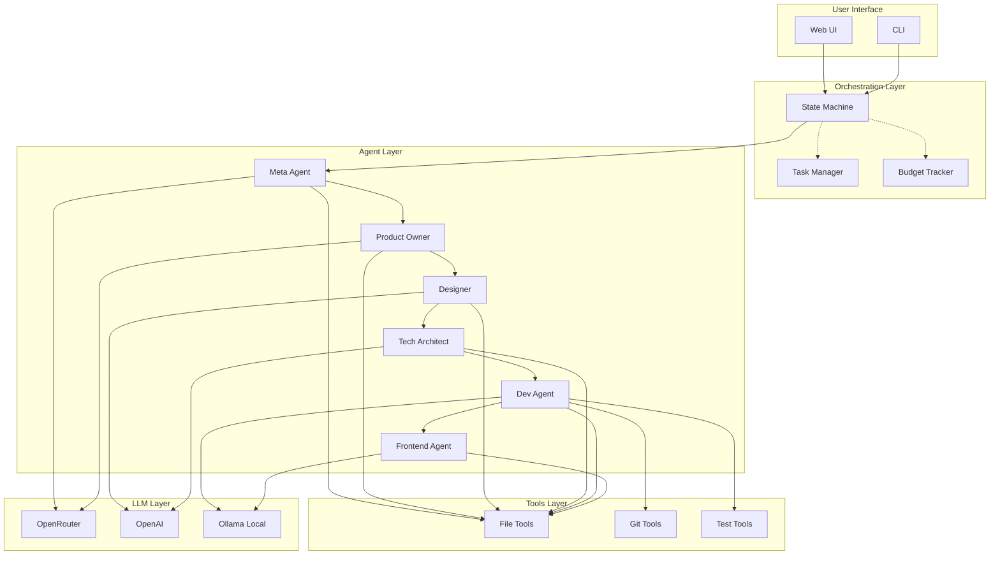
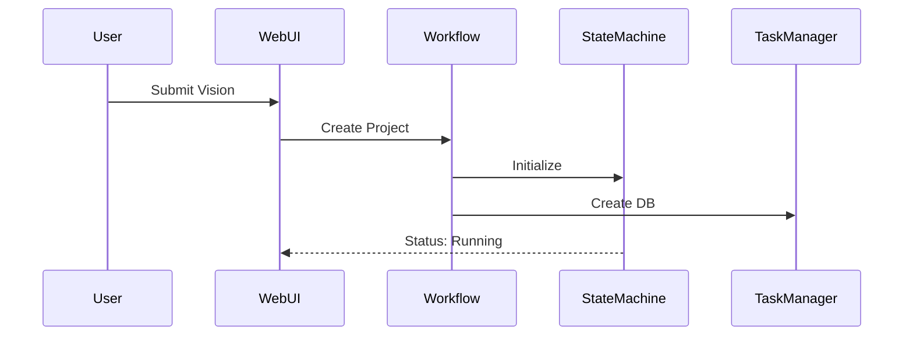
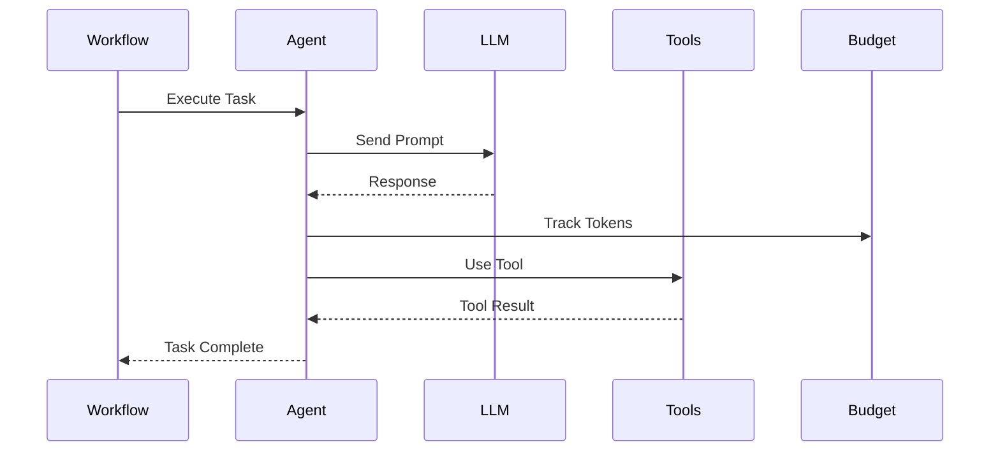
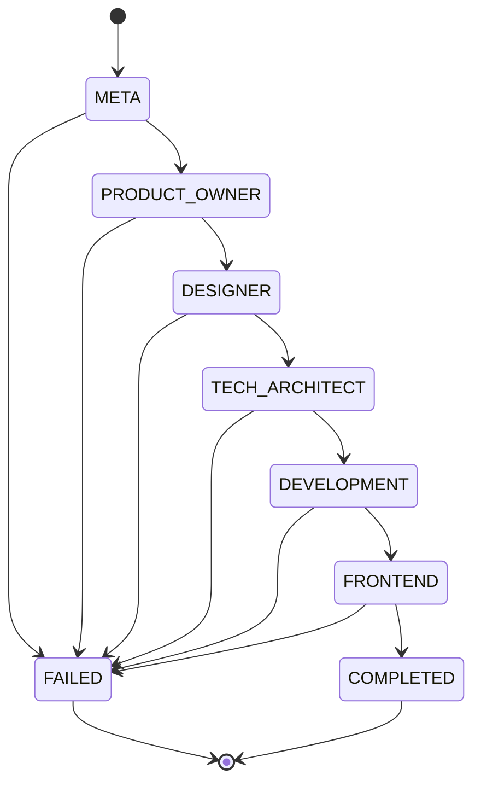

# System Architecture

## Overview

The AI Software Development Crew is built on a multi-agent architecture powered by LlamaIndex, designed for scalability, cost-efficiency, and maintainability.

## High-Level Architecture

## Core Components

### 1. Orchestration Layer

#### State Machine
- Manages workflow progression through defined states
- Enforces valid state transitions
- Provides rollback capability for error recovery
- Tracks state history

**States:**
- `META` - Agent configuration
- `PRODUCT_OWNER` - Requirements gathering
- `DESIGNER` - Design specification
- `TECH_ARCHITECT` - Technology selection
- `DEVELOPMENT` - Code implementation
- `FRONTEND` - UI implementation
- `COMPLETED` - Successful completion
- `FAILED` - Error state

#### Task Manager
- Tracks task lifecycle with SQLite persistence
- Validates task completion
- Manages dependencies between tasks
- Provides task history and audit trail

#### Budget Tracker
- Monitors token usage across all LLM calls
- Enforces budget limits (per project, per hour)
- Tracks costs by agent and phase
- Provides real-time budget reports

### 2. Agent Layer

#### Meta Agent
- **Role**: Generate custom agent backstories
- **Technology**: LlamaIndex ReActAgent
- **Input**: Project vision
- **Output**: Agent configurations with OPL techniques

#### Product Owner Agent
- **Role**: Create user stories and requirements
- **Technology**: LlamaIndex ReActAgent
- **Input**: Vision, Meta configuration
- **Output**: `requirements.md`, `user_stories.md`

#### Designer Agent
- **Role**: Design system architecture
- **Technology**: LlamaIndex ReActAgent
- **Input**: User stories, requirements
- **Output**: `design_spec.md`

#### Tech Architect Agent
- **Role**: Define technology stack
- **Technology**: LlamaIndex ReActAgent
- **Input**: Design spec, user stories
- **Output**: `tech_stack.md`, file structure

#### Dev Agent
- **Role**: Implement features using TDD
- **Technology**: LlamaIndex ReActAgent
- **Input**: Design, tech stack, features
- **Output**: Source code, tests
- **Tools**: FileWriter, Git, TestRunner

#### Frontend Agent
- **Role**: Implement UI components
- **Technology**: LlamaIndex ReActAgent
- **Input**: Design spec, tech stack
- **Output**: UI code, components

### 3. Tools Layer

#### File Tools
- `FileWriterTool` - Write files with safety checks
- `FileReaderTool` - Read file contents
- `FileListTool` - List directory contents

#### Git Tools
- `GitInitTool` - Initialize repository
- `GitCommitTool` - Commit changes
- `GitStatusTool` - Check repository status
- `GitLogTool` - View commit history

#### Test Tools
- `PytestRunnerTool` - Execute pytest tests
- `TestValidatorTool` - Validate test results

### 4. LLM Layer

#### OpenRouter
- **Use**: Manager and Worker agents
- **Models**: Grok, Qwen, Claude
- **Benefits**: Cost-efficient, free tier available

#### OpenAI
- **Use**: Reviewer agents
- **Models**: GPT-4, GPT-3.5
- **Benefits**: High quality, consistent

#### Ollama (Local)
- **Use**: Development environment
- **Models**: Llama 3.2, Mistral
- **Benefits**: Free, privacy, offline

## Data Flow

### 1. Project Initialization

### 2. Agent Execution

### 3. State Transitions

## Scalability

### Horizontal Scaling
- Stateless agents can run on different nodes
- SQLite can be replaced with PostgreSQL for multi-instance
- Redis for distributed caching
- RabbitMQ for async job queue

### Vertical Scaling
- Increase max_iterations for complex projects
- Use more powerful LLM models
- Increase budget limits

## Security

### API Keys
- Stored in `.env` file (gitignored)
- Loaded via `python-dotenv`
- Never logged or exposed

### File Operations
- All writes restricted to workspace directory
- Path traversal prevention
- File size limits enforced

### Budget Controls
- Hard limits on token usage
- Per-project and per-hour limits
- Alert thresholds

## Performance

### Optimization Strategies
1. **Parallel Tool Calls** - Multiple tools executed concurrently
2. **Caching** - LLM responses cached when appropriate
3. **Local Models** - Ollama for development
4. **Efficient Prompts** - Concise, targeted prompts
5. **Max Iterations** - Limited to prevent runaway costs

### Metrics
- **Average Project Cost**: $1-2
- **Average Completion Time**: 5-10 minutes
- **Success Rate**: > 90%
- **Budget Compliance**: 100%

## Monitoring

### Available Metrics
- Token usage per agent
- Cost per phase
- Task completion rates
- Error rates
- State transition history

### Logging
- Structured logging with `logging` module
- Log levels: DEBUG, INFO, WARNING, ERROR
- Log rotation for production

## Future Enhancements

- [ ] Distributed execution with RabbitMQ
- [ ] PostgreSQL for multi-instance
- [ ] Kubernetes deployment
- [ ] Grafana dashboards
- [ ] Prometheus metrics
- [ ] Advanced RAG with vector DB
- [ ] Multi-tenancy support
