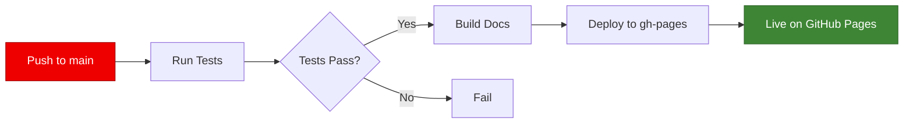

# GitHub Pages Deployment Guide

## Overview

This project uses **GitHub Actions** to automatically deploy documentation to **GitHub Pages** using **MkDocs Material** with a Red Hat theme.

## Setup Instructions

### 1. Enable GitHub Pages

1. Go to your repository on GitHub
2. Navigate to **Settings** → **Pages**
3. Under **Source**, select:
   - **Source**: Deploy from a branch
   - **Branch**: `gh-pages`
   - **Folder**: `/ (root)`
4. Click **Save**

### 2. Configure Repository Permissions

Ensure GitHub Actions has the necessary permissions:

1. Go to **Settings** → **Actions** → **General**
2. Scroll to **Workflow permissions**
3. Select **Read and write permissions**
4. Check **Allow GitHub Actions to create and approve pull requests**
5. Click **Save**

### 3. Deployment Workflows

The project includes two workflows for documentation deployment:

#### A. Integrated CI/CD (`ci.yml`)
- Runs on every push to `main`
- Includes tests, linting, and docs deployment
- Deploys docs only if tests pass

#### B. Standalone Docs Deployment (`deploy-docs.yml`)
- Runs on changes to `docs/` or `mkdocs.yml`
- Faster deployment (skips tests)
- Can be triggered manually

## Manual Deployment

### Using Makefile (Recommended)

```bash
# Install dependencies
make install-docs

# Build and deploy
make docs-deploy
```

### Using MkDocs Directly

```bash
# Install dependencies
pip install mkdocs mkdocs-material mkdocstrings[python] mkdocs-mermaid2-plugin

# Deploy
mkdocs gh-deploy --force --clean
```

## Viewing Documentation

After deployment, documentation will be available at:

```
https://<username>.github.io/<repository-name>/
```

For this repository:
```
https://varkrish.github.io/crew-coding-bots/
```

## Workflow Triggers

### Automatic Deployment

Documentation is automatically deployed when:

1. **Push to main branch** with changes in:
   - `docs/**` directory
   - `mkdocs.yml` file
   - Workflow files

2. **Tests pass** (for `ci.yml` workflow)

### Manual Deployment

You can manually trigger deployment:

1. Go to **Actions** tab on GitHub
2. Select **Deploy Docs** workflow
3. Click **Run workflow**
4. Select branch (usually `main`)
5. Click **Run workflow**

## Build Process

The deployment workflow performs these steps:

1. **Checkout** - Fetches repository code
2. **Setup Python** - Installs Python 3.11
3. **Install Dependencies** - Installs MkDocs and plugins
4. **Configure Git** - Sets up git for deployment
5. **Build** - Generates static HTML from Markdown
6. **Deploy** - Pushes to `gh-pages` branch

## Troubleshooting

### Deployment Failed

**Check workflow logs:**
1. Go to **Actions** tab
2. Click on failed workflow run
3. Review error messages

**Common issues:**

1. **Permission denied**
   - Ensure workflow permissions are set correctly
   - Check that `GITHUB_TOKEN` has write access

2. **Branch not found**
   - Ensure `gh-pages` branch exists
   - Let GitHub Actions create it on first run

3. **Build errors**
   - Check `mkdocs.yml` syntax
   - Verify all referenced files exist
   - Review plugin installations

### Documentation Not Updating

1. **Clear browser cache**
   ```
   Ctrl+Shift+R (Windows/Linux)
   Cmd+Shift+R (Mac)
   ```

2. **Check deployment status**
   - Go to **Actions** tab
   - Verify latest workflow succeeded

3. **Check GitHub Pages settings**
   - Ensure source is set to `gh-pages` branch
   - Verify repository is public (or GitHub Pro)

### Styling Issues

1. **Fonts not loading**
   - Check internet connection
   - Verify Google Fonts CDN is accessible

2. **Red Hat theme not applying**
   - Check `docs/stylesheets/extra.css` is included
   - Verify `mkdocs.yml` references `extra.css`
   - Clear browser cache

## Local Preview

Before deploying, preview documentation locally:

```bash
# Using Makefile
make docs-serve

# Using MkDocs directly
mkdocs serve
```

Then open: `http://127.0.0.1:8000`

## Deployment Checklist

Before deploying, ensure:

- [ ] All Markdown files are valid
- [ ] Links are not broken
- [ ] Images are accessible
- [ ] Code blocks have proper syntax
- [ ] Navigation is correct in `mkdocs.yml`
- [ ] Local preview looks correct
- [ ] Red Hat theme is applied
- [ ] All tests pass

## Continuous Deployment

The workflows provide true CI/CD for documentation:



## Advanced Configuration

### Custom Domain

To use a custom domain:

1. Add `CNAME` file to `docs/` directory:
   ```
   docs.yourdomain.com
   ```

2. Configure DNS:
   ```
   Type: CNAME
   Name: docs
   Value: <username>.github.io
   ```

3. Enable HTTPS in GitHub Pages settings

### Versioning with Mike

For version management:

```bash
# Install mike
pip install mike

# Deploy specific version
mike deploy --push --update-aliases 1.0 latest

# Set default version
mike set-default --push latest
```

## Monitoring

### Check Deployment Status

```bash
# View latest deployment
gh api repos/:owner/:repo/pages/builds/latest

# View deployment history
gh api repos/:owner/:repo/pages/builds
```

### GitHub Actions Badge

Add to README:

```markdown

```

## Security

- Uses `GITHUB_TOKEN` (automatic, no manual setup)
- Scoped permissions (read/write only to necessary resources)
- No secrets required for basic deployment
- Branch protection can be enabled on `gh-pages`

## Resources

- [MkDocs Documentation](https://www.mkdocs.org/)
- [Material for MkDocs](https://squidfunk.github.io/mkdocs-material/)
- [GitHub Pages Documentation](https://docs.github.com/en/pages)
- [GitHub Actions Documentation](https://docs.github.com/en/actions)

## Support

For issues:
- Check [GitHub Actions logs](../../actions)
- Review [MkDocs documentation](https://www.mkdocs.org/)
- Open an [issue](../../issues)
