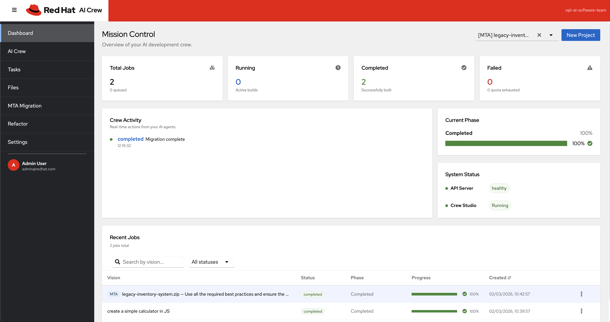
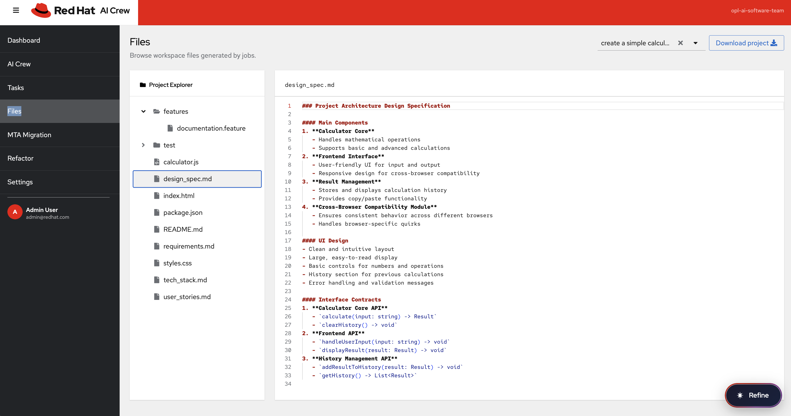
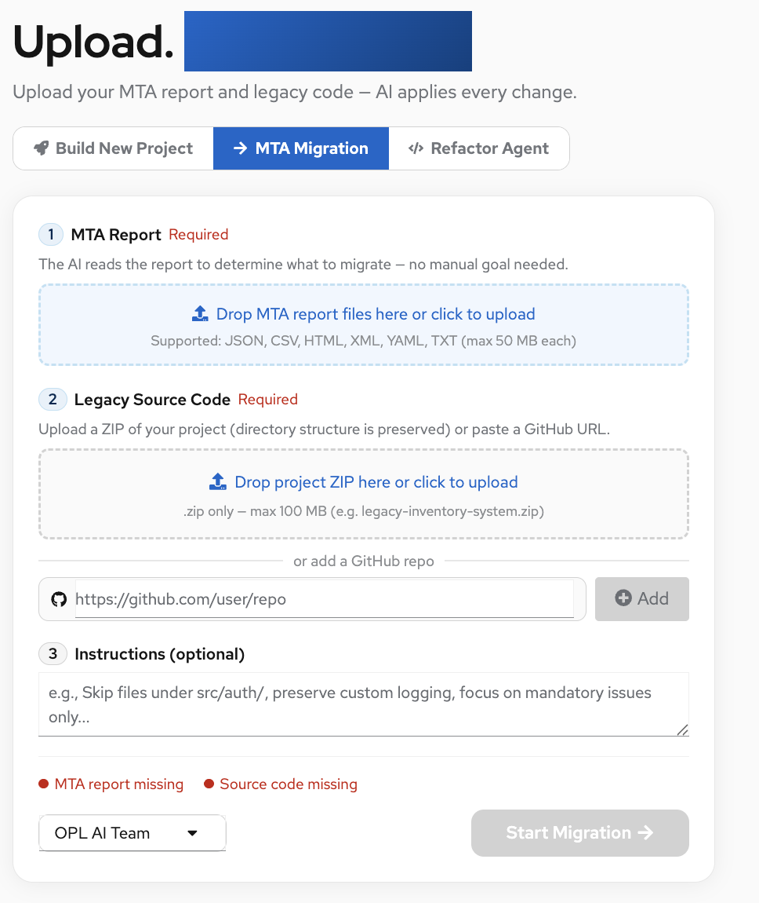
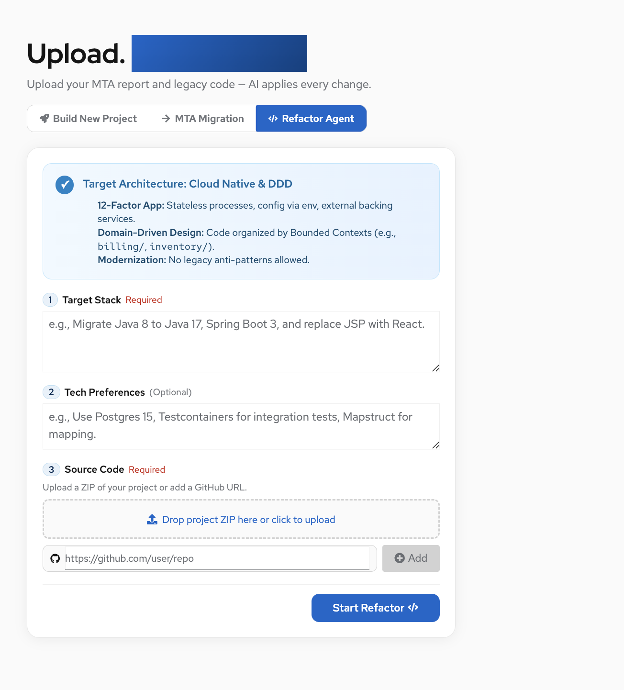

# Dashboard and UI

This document describes the Crew Studio UI features: dashboard listing, pagination, filtering, sorting, and job selection across the app.

## Dashboard (Jobs List)

The main dashboard shows all jobs with server-side pagination, filtering, and sorting.

### Pagination

- **API:** `GET /api/jobs?page=1&page_size=10` (defaults: page 1, page_size 10; page_size capped at 100).
- **Response:** `jobs`, `total`, `page`, `page_size`.
- **UI:** PatternFly `Pagination` with per-page options (e.g. 10, 20, 50). Changing page or per-page triggers a new request.

### Filtering

- **By vision (search):** `vision_contains` — substring match on job vision text.
- **By status:** `status` — one of `running`, `completed`, `failed`, `queued`, `cancelled`, `quota_exhausted`.
- **API:** `GET /api/jobs?page=1&page_size=10&vision_contains=calculator&status=completed`
- **UI:** Toolbar with SearchInput (vision) and Status dropdown; filters are applied together with pagination.

### Sorting

- **API:** `sort_by` and `sort_order` (e.g. `sort_by=created_at`, `sort_order=desc`). Supported columns: `vision`, `status`, `current_phase`, `progress`, `created_at`.
- **UI:** Table column headers are clickable; sort indicator (e.g. SortAmountDownIcon/SortAmountUpIcon) shows current column and order.

### Screenshot: Dashboard

---

## Job Selection (Files, Tasks, Agents, Migration, Refactor)

Where the UI needs to pick a job (Files, Tasks, Agents, Migration, Refactor), the job selector is a **searchable dropdown** (typeahead), not a plain list.

- **Component:** `JobSearchSelect` — uses server-side search via `GET /api/jobs?page=1&page_size=100&vision_contains=<query>` so it scales to many jobs.
- **Behavior:** User types to search by vision; options load from the API; selecting a job loads that job’s context (files, tasks, agents, migration, or refactor).

### Screenshot: Files page

The Files page shows the searchable job dropdown and the file tree for the selected job.

---

## Other Pages with Pagination

- **Migration:** Job list and migration issues support pagination where applicable (see [migration.md](migration.md)). Screenshot: [migration-page.png](images/migration-page.png).
- **Refactor:** Refactor job list uses the same jobs API and can show paginated results. Screenshot: [refactor.png](images/refactor.png).

---

## API Summary

| Endpoint | Query params | Purpose |
|----------|--------------|---------|
| `GET /api/jobs` | `page`, `page_size`, `vision_contains`, `status`, `sort_by`, `sort_order` | Paginated, filterable, sortable job list |
| `GET /api/jobs/:id` | — | Single job details |
| `GET /api/jobs/:id/progress` | — | Progress, phase, last message |
| `GET /api/jobs/:id/files` | — | Workspace file list for job |
| `GET /api/workspace/files` | `job_id` | Workspace files for a job |

See [README](../README.md) and [REFINEMENT_AND_UI.md](REFINEMENT_AND_UI.md) for refinement and file-tree behavior.
