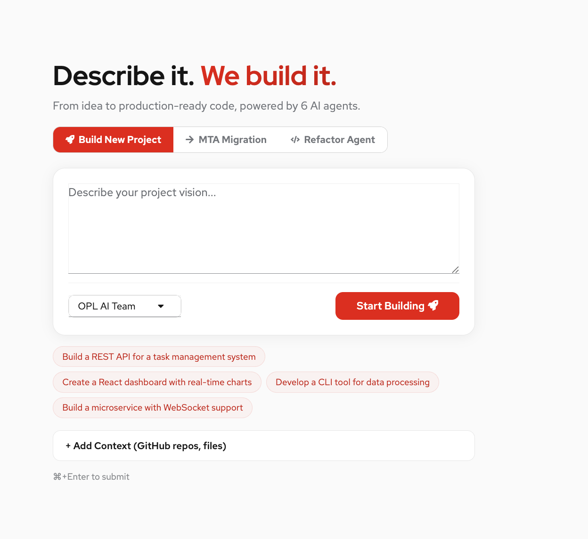

# Platform Overview

AI Software Development Crew (Crew Studio) is a multi-agent platform that turns a natural-language vision into production-ready code. This document describes the main functionalities as of the latest release.

## Landing / Create job

## High-Level Capabilities

| Area | Description |
|------|-------------|
| **Build from vision** | Submit a short description (e.g. "create a simple calculator in JS"); the system runs Meta → Product Owner → Designer → Tech Architect → Development → Frontend phases and produces a full project. |
| **Task-level tracking** | Each phase is broken into granular tasks stored in SQLite. The dashboard and APIs expose progress, phase, and per-task status. |
| **Refinement** | After a job completes, use natural language to refine the generated code (file-level or project-wide) via the Refine panel. |
| **MTA migration** | Upload an MTA report and source code; the platform runs a two-phase pipeline to analyze and apply migration changes with per-file issue tracking. |
| **Refactor** | Run refactoring jobs (e.g. target stack change) with the same task-tracking and workspace model as builds. |
| **LLM & embeddings** | LLM calls use Red Hat MaaS (or any OpenAI-compatible API). Embeddings use local HuggingFace models by default (no OpenAI dependency). |

## Architecture at a Glance

- **Backend:** Flask API (`crew_studio/llamaindex_web_app.py`) on port 8081; job and task data in SQLite (`crew_jobs.db`).
- **Frontend:** React + PatternFly + Vite (`studio-ui/`), dev server on port 3000; proxies `/api` and `/health` to the backend.
- **Agent framework:** LlamaIndex-based workflows and agents under `agent/src/llamaindex_crew/` (and legacy `ai_software_dev_crew`); granular tasks and code validation in `orchestrator/`.

## Workflow Phases

1. **Meta** — High-level plan and scope.
2. **Product Owner** — User stories and requirements.
3. **Designer** — Design spec and feature breakdown.
4. **Tech Architect** — Tech stack and file-level task list (SQLite).
5. **Development** — Per-file code generation with validation and retry.
6. **Frontend** — UI/assets if applicable.
7. **Completed** — Job marked complete; outputs available in workspace and via Files UI.

## Key Documentation

- [Dashboard and UI](dashboard-and-ui.md) — Pagination, filtering, sorting, job search.
- [Code quality and validation](code-quality-and-validation.md) — Multi-language validation, retries, workspace checks.
- [Refinement & Studio UI](REFINEMENT_AND_UI.md) — Refine flow and UI behavior.
- [MTA migration](migration.md) — Upload, pipeline, and APIs.
